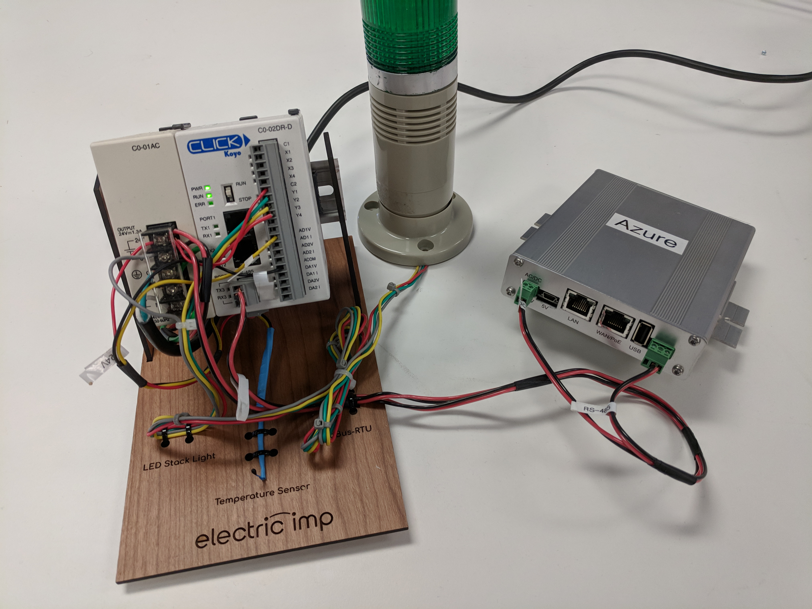
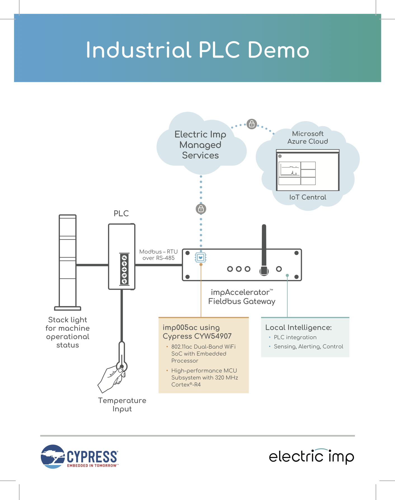
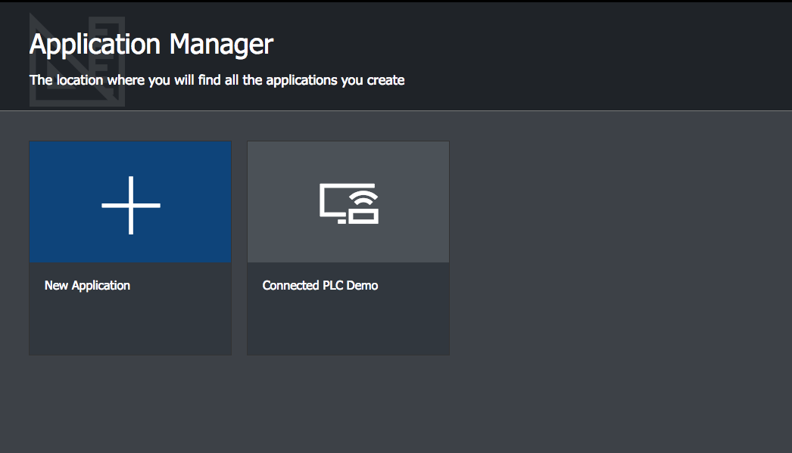
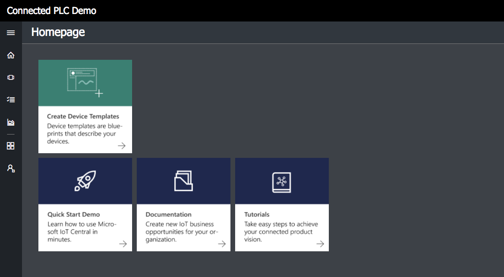
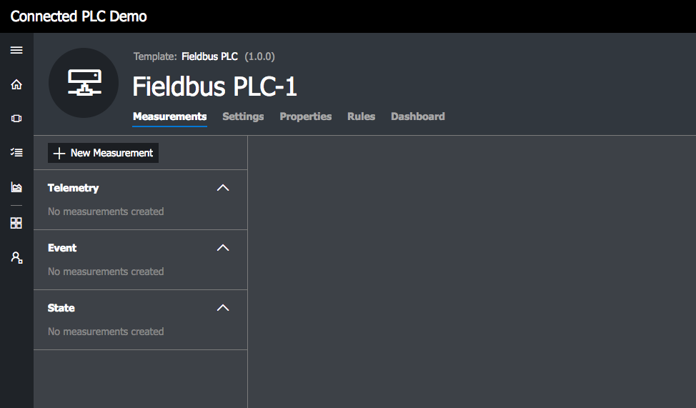
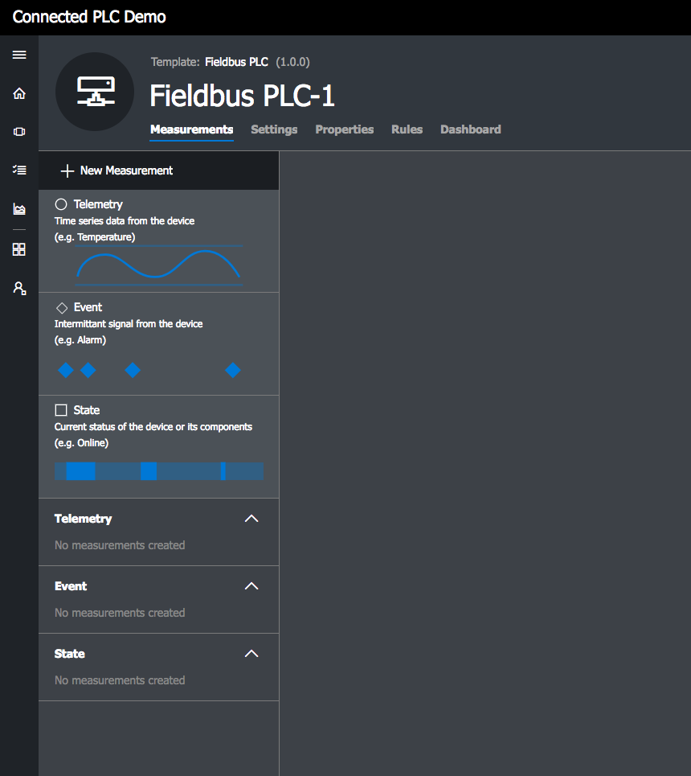
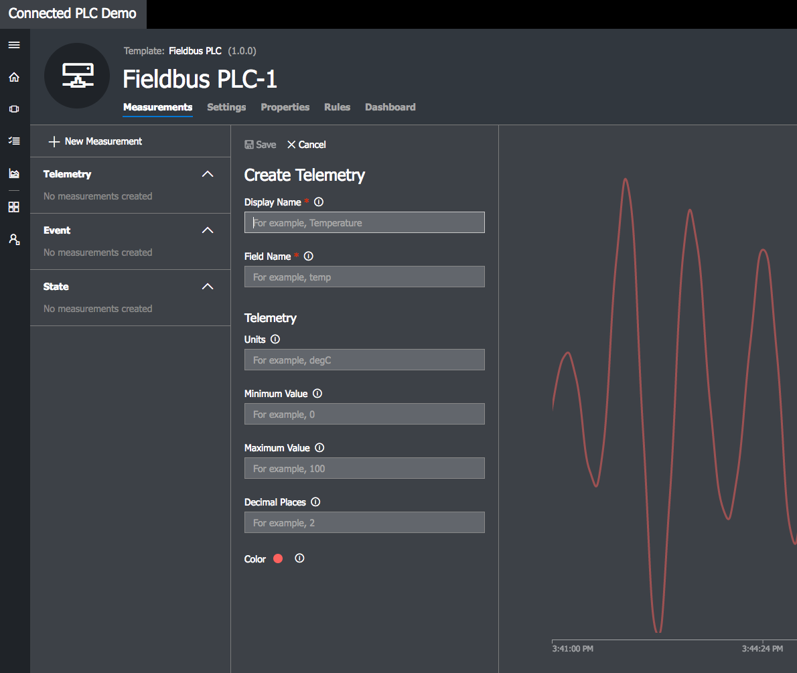

# MS_IoTCentral_Temp_Stack_Light_PLC_Demo

In this example, you begin by learning the basics of working with Electric Imp. We will use Electric Imp Libraries to seamlessly connect imp-enabled hardware to Azure IoT Central. Your imp-enabled hardware device will report environmental sensor data through the Electric Imp impCloud into Azure IoT Central. This example uses an impAccelerator Fielbus Gateway and the Electric Imp [Modbus Library](https://github.com/electricimp/Modbus) to monitor the temperature via a Click PLC. The temperature is monitored locally by a Stack Light that the Click PLC triggers when the temperature has reached a threshold value, and also remotely by sending data to Microsoft Azure cloud by using the Electic Imp [AzureIoTHub libray](https://github.com/electricimp/AzureIoTHub). Once data is in the Azure cloud the temperature can be monitored using your Azure IoT Central application.


## What You Do

* Configure your impAccelerator™ Fieldbus Gateway with BlinkUp&trade;.
* Create an Azure IoT Central application.
* Register your device in IoT Central.
* Run a sample application using the impCentral to send sensor data to Azure IoT Central.

## What You Learn

* How to configure your imp-enabled device with BlinkUp.
* How to use impCentral.
* How to create an Azure IoT Central application.
* How to register your device with Azure IoT Central and get your connection string.
* How to collect temperature data from a sensor.
* How to send sensor data to Azure IoT Central.

## What You Need

1. Your 2.4GHz 802.11bgn WiFi network *name* (SSID) and *password*.
2. A computer with a web browser.
3. A smartphone with the Electric Imp app ([iOS](https://itunes.apple.com/us/app/electric-imp/id547133856) or [Android](https://play.google.com/store/apps/details?id=com.electricimp.electricimp)).
4. A free [Electric Imp Account](https://impcentral.electricimp.com/login).
5. A [Microsoft Account](https://login.microsoftonline.com).
6. [impAccelerator™ Fieldbus Gateway](https://store.electricimp.com/products/impaccelerator-fieldbus-gateway?variant=31118564754)
7. [C0-02DD1-D Click PLC](https://www.automationdirect.com/adc/Shopping/Catalog/Programmable_Controllers/CLICK_Series_PLCs_(Stackable_Micro_Brick)/PLC_Units/C0-02DD1-D?utm_source=google&utm_medium=product-search&gclid=CPeB4NWljNQCFUlNfgod9l4OVg).
8. Thermistor.
9. Stack Light.
9. Power Supply.

## Hardware Setup

TODO: REPLACE THIS SECTION WITH CORRECT SETUP AND photo and/or wiring diagram 

- Connect Fieldbus Gateway to Click PLC via RS485.
- Connect Thermistor to Click PLC Analog input.
- Connect Stack Light to Click PLC.
- Connect the PLC and and the Fieldbus Gateway to the power supply.

Assembled, the hardware should look like this:




## Step by step instructions

To get started with a impAccelerator™ Fieldbus Gateway follow the steps below, or for more detailed instructions you can visit our DevCenter's [Getting Started Guide](https://developer.electricimp.com/hardware/fieldbusgateway/intro).

### Electric Imp BlinkUp

Open the Electric Imp mobile app on your smartphone to configure your device.

1. Log into your Electric Imp account.
2. Click on **Configure a Device**
3. Select **Wireless**
4. Enter your 2.4GHz 802.11bgn WiFi credentials, then click **Next**
5. Follow the instructions in the app to configure your device for local network access.
6. If you have any trouble here is a [link](https://electricimp.com/docs/hardware/fieldbusgateway/blinkup/) to the DevCenter's BlinkUp instructions.

### How Electric Imp’s IoT Connectivity Platform Works

The Electric Imp Platform has two main components: the imp-enabled device and the impCloud&trade;. The imp-enabled device runs the device code, which in this use case consolidates the data gathered from the temperature sensor via the Click PLC. Each device is paired one-to-one with its own online assistant &mdash; or, as we call it, an ‘agent’ &mdash; in the impCloud and which runs the agent code. The device sends this data to its agent. In this example, the agent code relays the data to the Azure IoT Central cloud. Here’s a broad overview of this flow:



With impCentral Electric Imp provides all the tools you need to write and deploy the software (to the device and to its agent) that will control your imp-enabled connected product. impCental runs in a desktop web browser and communicates between the device and cloud solutions.

### Working With impCentral

1. Open your web browser and log in to the [impCentral](https://impcentral.electricimp.com/login).
2. Click the **+ Create New Product** button to create a new Electric Imp application.
3. In the pop-up panel, name your **Product** and **Development Device Group** and click **Create**. A code editor will automatically open.
4. Next you will need to assign your device to the Device Group you just created. In the bottom section of the code editor click the **Assign devices** button.
5. In the pop-up panel find your device and click **Assign**. 
6. If you have any trouble here is a [link](https://developer.electricimp.com/gettingstarted/explorer/ide) to the DevCenter's impCentral guided tour.
7. Copy and paste the application code from GitHub into the code editor. 
    - [Agent Code](./MS_IoTCentral_PLC_Temp_Stack_Demo.agent.nut) should be placed in the *Agent Code* window to the left in the code editor.
    - [Device Code](./MS_IoTCentral_PLC_Temp_Stack_Demo.device.nut) should be placed in the *Device Code* window to the right in the code editor.

### Create an IoT Central Application

1. Login to [Microsoft IoT Central](https://apps.azureiotcentral.com/), click **+ New Application**:



2. In the pop-up panel select:

 - Choose payment plan: **Free**.

 - Select an application template: **Custom Application**.

 - Enter an Application Name: **YOUR APPLICATION NAME**. For this example I'll use the name: *Connected PLC Demo*. Note: The URL field will auto poplutate to match the Application name.

 - Click **Create** button. You will be redirected to your Applicaation's home page.

### Create an IoT Central Device Template

1. On the Homepage Click on the **Create Device Templates** shortcut to create a device template. This will also create your first device of this type:

 

2. Enter the name for your device template. For this example I'll use the name *Fieldbus-PLC*, since my devices will be Fieldbus Gateways with PLCs attached:


3. After creating a device template your first simulated device will be automatically created. You can edit the device name and upload a photo if desired.

4. Next we need to match the data that the imp is sending via the application code with the device template we are creating. For this application we are going to track *temperature* and *temperatureAlert* telemetry data. The data structure is defined on lines 110-113 of the example device code (see code snapshot below):

```squirrel
local data = 
    {"temperature" : convertReading(reading),
     "temperatureLimit" : tempThresh,
     "temperatureAlert" : 0}; 
```

5. Add **temperature** to the device template: 
 - Click **+ New Measurement** 



 - Select **Telemetry**.



 - Fill in Telemetry form:



    - Fill in the **Display Name**, this will be displayed in your application.
    - Fill in **Field Name**, this must match the code from your device, so for this example this field must be *temperature*.
    - (Optional) fill in **Units**, for this example *degC*.
    - (Optional) **Minimum Value**, graphing will use this value to set the y axis, so choose a value that makes sense for your application. I have used a value of *10*.
    - (Optional) **Maximum Value**, graphing will use this value to set the y axis, so choose a value that makes sense for your application. I have used a value of *40*.
    - (Optional) **Decimal Places**, enter the number of decimal places your data should display. I have used a value of *0*.
    - At the top of the form click **Save**.

6. Add **temperatureAlert** to the device template: 
 - Click **+ New Measurement** 
 - Select **Telemetry**. 
 - Fill in Telemetry form:
    - Fill in the **Display Name**, this will be displayed in your application.
    - Fill in **Field Name**, this must match the code from your device, so for this example this field must be *temperatureAlert*.
    - (Optional) fill in **Units**, for this example I've left this blank.
    - (Optional) **Minimum Value**, graphing will use this value to set the y axis, so choose a value that makes sense for your application. I have used a value of *0*.
    - (Optional) **Maximum Value**, graphing will use this value to set the y axis, so choose a value that makes sense for your application. I have used a value of *1.5*.
    - (Optional) **Decimal Places**, enter the number of decimal places your data should display. I have used a value of *0*.
    - At the top of the form click **Save**.

### Connect your Imp to IoT Central

1. Navigate to the Device Explorer tab.
2. Click **+ New** from the menu options, and select **Real**.
3. Click **Connect the device** from the top right just under the account info.
4. Copy the **Primary connection string** from the pop-up.
5. Open the impCentral code editor and paste the **Primary connection string** into the agent code **DEVICE_CONNECTION_STRING** constant. (TODO: update with line number when code edit is tested)

```squirrel
////////// Application Variables //////////
const DEVICE_CONNECTION_STRING = "HostName=saas-iothub-5428cf2a-c98c-411e-9e11-187e77941f50.azure-devices.net;DeviceId=1uu3d46;SharedAccessKey=UmtN3B+pHF8Hzm6RcPIMuXputsfTQTwVgy5e12J6CuE=";


// Start the Application
Application(DEVICE_CONNECTION_STRING);
```

